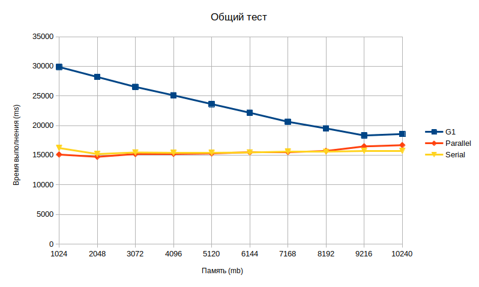
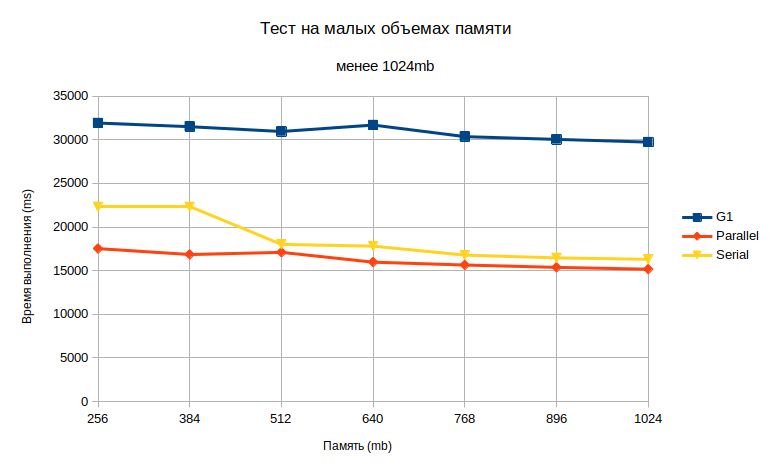

# Тестовое задание: определить оптимальный размер хипа jvm.

## Методика тестирования.

Программа запускалась из терминала, чтобы минимизировать 
воздействие IDE. Для сборки "толстого" jar-файла использовался плагин `shadowJar`. 
Для упрощения запуска 
jvm с различными параметрами был написан небольшой bash-скрипт (находится в папке `bash`).
Граничные параметры редактировались вручную. 

Тесты были проведены для трех реализаций gc: G1GC, ParallelGC и SerialGC. Конфигурация компьютера:
12-ядерный процессор AMD Ryzen5, 16 Gb RAM, SSD.

## Оптимизация

В программе для эмуляции сложного вычисления используется цикл со множеством итераций, в котором
осуществляются простые арифметические действия с объектом `Data`, содержащим единственное поле
типа `Integer`. Если заменить `Integer` на примитивный `int`, мы получаем прирост скорости
в сотни процентов. 

Также пришлось отказаться от иммутабельности объекта `Data`. Это исключило 
необходимость создания множества объектов в цикле внутри метода `main()`. Оптимизированная версия тестовой
программы находится в пакете `optimized`.

### Результаты

Сначала тестировалась неоптимизированная версия программы. Логи находятся в папке `logs`. Были проведены две серии тестов:
в диапазоне значений памяти от 1024 до 10240 Мб
с шагом в 1024 Мб, а также от 256 Мб до 1024 Мб с шагом в 128 Мб (логи находятся в подпапках с постфиксом имени "1024").

Видим, что G1 показывает плавный прирост производительности в диапазоне от 1Гб памяти до 9Гб, далее рост производительности
останавливается. Производительность Parallel и Serial gc практически не зависит от объема памяти, даже слегка снижается при
объеме хипа выше 8Гб.

G1 на объемах памяти до 1Гб не показывает увеличения производительности и существенно проигрывает двум другим реализациям gc.
SerialGC несколько отстает от ParallelGC на хипе менее 512Мб, но в дальнейшем сравнивается с ним по скорости работы.

Оптимизированная версия тестовой программы не вызывает срабатывания ни одного из типов gc даже на памяти размером 128 Мб,
время работы не превышает 4500 мс. Тестирование на других объемах памяти не производилось. Логи находятся в папке logs/optimized.

### Выводы

Увеличение хипа jvm положительно сказывается на производительности тестовой программы (и, очевидно, схожих с ней программ,
интенсивно порождающих большое количество объектов), но увеличение производительности нелинейно, и сильно зависит от типа
используемого сборщика мусора. Для данной тестовой программы (её неоптимизированной версии) оптимальным является размер
памяти 640 - 1024 Мб и использование ParallelGC.

Оптимизация путем перехода на примитивные типы совместно с переиспользованием объектов в цикле вместо их создания может повысить
скорость работы программы на несколько сотен процентов.

